  
  
  
  
  

## 概要

チャットアプリです。 
LINEのように個人間のチャットもグループチャットもできます。 
[forem](https://github.com/forem/forem)のコードを参考にしています。

## ER図

## 使用技術

### 開発環境

- Windows 10 Home
- Docker
- Docker Compose

### フロントエンド

- HTML
- SCSS
- JavaScript
- 主要モジュール
  - Bootstrap
  - Popper

### バックエンド

- Ruby 2.6.6
- Ruby on Rails 6.0.4.1
- 主要Gem
  - Bullet
  - CarrierWave
  - Devise
  - Pundit
  - RSpec
  - RuboCop

### DB、インフラなど

- CircleCI
- Heroku
- PostgreSQL 13.3
- Puma
